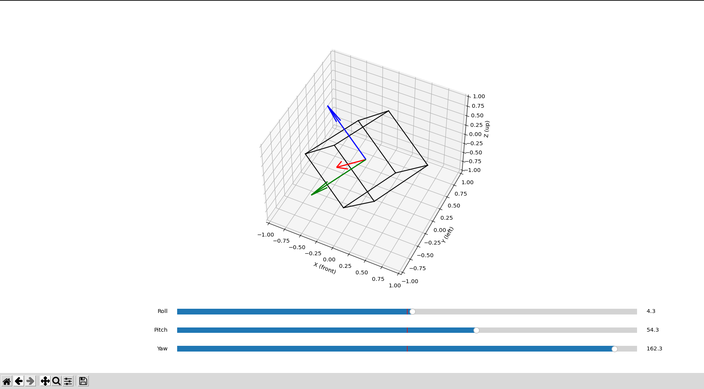
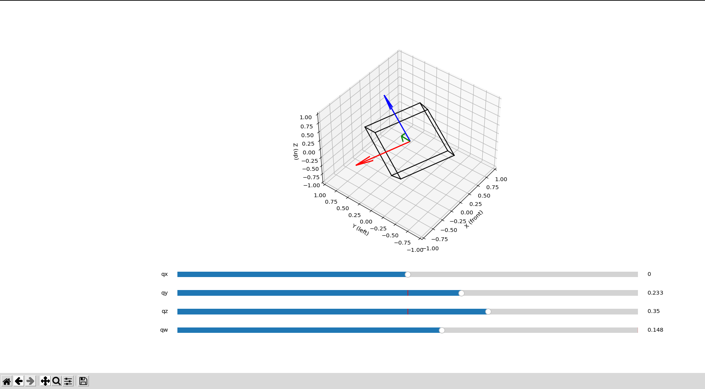

# Rotation Inspector
THis is a simple tool to understand any rotation applied to any frame visually before complex transforms.

# Requirements
This package has been tested on Ubuntu 22.04 and Python 3.10.

# Setup
Clone the repo:
```
https://github.com/ArghyaChatterjee/Rotation-Inspector.git
```
Install numpy and matplotlib. That's it.

# Demo Usage
## Euler Rotation Plotting:
```
cd scripts
python3 euler_rotation_plotter.py
```
<div align="center">
  
</div>

You can change the euler angles `roll`, `pitch` and `yaw` of the plot to see your desired transform in action. The plot is `x` forward, `y` left and `z` up.

## Quaternion Plotting:
```
cd scripts
python3 quaternion_plotter.py
```
<div align="center">
  
</div>

You can change the euler angles `qx`, `qy`, `qz` and `qw` of the plot to see your desired transform in action. The plot is `x` forward, `y` left and `z` up.
